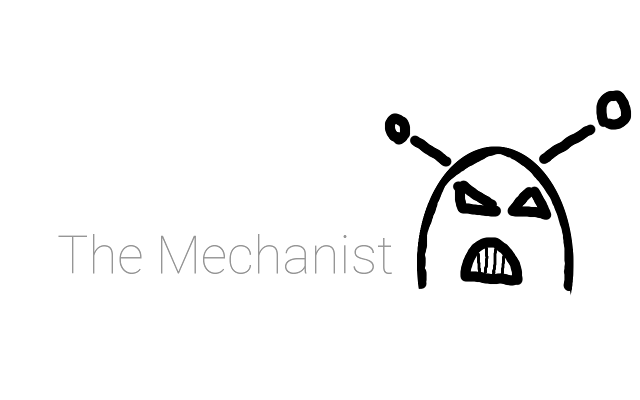

## What is The Mechanist ?
The Mechanist is a collection of Dockerfiles and Composefiles for various tools
and purposes.
The Dockerfiles provided here are written to be clean, lightweight, readable and
extensible by other users according to their needs.
The Compose files using these Dockerfiles can be used as provided but are made
to be be updated for other purposes.
This repository is intended to evolve with new files and updates.

## Quickstart

* [Consul](./consul/README.md)
* [Redis](./redis/README.md)

## FAQ

Do you know you designed a cheap logo for a bunch of Dockerfiles ?

I do.

Nice thing that I can override arguments you placed in "CMD" but I
cannot modify the ENTRYPOINT you provide.

You can override it by using the `--entrypoint` argument of `docker run`.
More info [here](https://docs.docker.com/engine/reference/run/#/entrypoint-default-command-to-execute-at-runtime).

## License
Every file provided here is available under the [MIT License](http://opensource.org/licenses/MIT).

## Not Good Enough ?
If you encouter any issue by using what is provided here, please
[let me know](https://github.com/TimTosi/mechanist/issues) ! 
Help me to improve by sending your thoughts to timothee.tosi@gmail.com !
