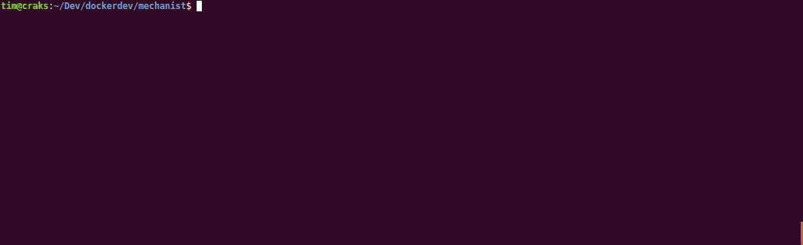

# Redis Docker

## Overview

These files are intended to provide a ready-to-use [consul](https://www.consul.io/)
environment based on Docker.

The Dockerfile aims to be generic, easily extensible and used according to the
user's will.

## Quickstart

Let's start by building the Docker Image:



From here you got a new shiny Docker Image of a consul agent you can play with:


## Dockerfile

The Docker Image you just created is based on [Alpine](https://alpinelinux.org/)
distribution and its total size is 30.21 MB.

This is lightweight and that works, though I would not use it in production as
it is because of my special needs. That is why you can override the consul
configuration in command line without specifying a configuration file that
would force you to create the Docker Image again.

Let's say you would like to change the node name of the consul server:


Nevertheless, you would have to specify TONS of arguments in command line, and
that is not really practical.

That is why you should directly use the Compose file instead.

## Compose File

The present Compose file sets up a basic consul cluster composed of three services:
* one consul agent in server & boostrap mode
* two consul agents server mode & joining the first one

```
    +-------------------+    +-------------------+    +-------------------+
    |                   |    |                   |    |                   |
    |     consul-01     |<-->|     consul-02     |<-->|     consul-03     |
    |                   |    |                   |    |                   |
    +-------------------+    +-------------------+    +-------------------+
```

But you can use it as you want in adding or updating provided services by
editing this very file.

Using this Compose file is as easy as:


## Not Good Enough ?

If you encouter any issue by using what is provided here, please
[let me know](https://github.com/TimTosi/mechanist/issues) ! 
Help me to improve by sending your thoughts to timothee.tosi@gmail.com !
